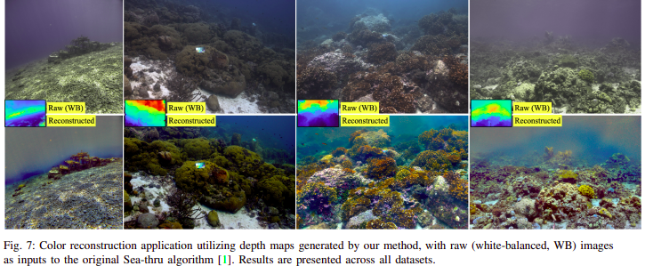

# Gaussian Splashing: Direct Volumetric Rendering Underwater

**Nir Mualem¹, Roy Amoyal¹, Oren Freifeld¹, Derya Akkaynak²**

¹Ben-Gurion University  
²The Inter-University Institute for Marine Sciences and the University of Haifa

| [Project Page](https://bgu-cs-vil.github.io/gaussiansplashingUW.github.io/) | [Paper](https://bgu-cs-vil.github.io/gaussiansplashingUW.github.io/) | [TableDB Dataset](https://bgu-cs-vil.github.io/gaussiansplashingUW.github.io/) |



This repository contains the official implementation of **Gaussian Splashing**, a fast underwater 3D reconstruction method that accounts for light attenuation and backscattering. The implementation extends [3D Gaussian Splatting](https://repo-sam.inria.fr/fungraph/3d-gaussian-splatting/) with specialized underwater image formation models and physics-based rendering.

## Abstract

Most useful features in underwater images are occluded by water. Consequently, underwater scenes present additional difficulties beyond the usual challenges of 3D reconstruction and rendering for in-air scenes. Naive applications of Neural Radiance Field methods (NeRFs) or Gaussian Splatting, while highly robust for in-air scenes, fail to perform underwater. 

Here we introduce **Gaussian Splashing**, a new method based on 3D Gaussian Splatting (3DGS), into which we incorporate an image formation model for scattering. Concretely, we introduce three additional learnable parameters to the rendering procedure, modify the depth estimation step for underwater conditions, alter the original loss term used in 3DGS, and introduce an additional loss term for backscatter. 

Our approach achieves **state-of-the-art performance** for underwater scenes and is highly efficient, with **3D reconstruction taking only a few minutes** and **rendering at 140 FPS**, despite the complexities of underwater adaptation. Notice how the improvement becomes significantly more pronounced as the view zooms out and the distance to the objects increases, with differences in far details clearly highlighted.

## Key Features

- **🌊 HYB Mode**: Hybrid underwater processing that models direct transmission, background infinity, and backscattering effects
- **⚡ Real-time Rendering**: Achieves ~140-160 FPS underwater scene rendering
- **🔬 Physics-based Image Formation**: Incorporates underwater scattering and attenuation models
- **🎯 Fast Training**: 3D reconstruction in just a few minutes
- **🛡️ Stable Training**: Includes NaN detection, gradient clipping, and robust loss computation
- **📊 TableDB Dataset**: New underwater dataset with captures from different distances and viewpoints

## Results

Our method dramatically improves underwater scene reconstruction compared to standard 3D Gaussian Splatting:

- **Red Sea Scene**: Clear improvements in color accuracy and detail preservation
- **Curacao Scene**: Rendered at 154 FPS with accurate depth estimation
- **Panama Scene**: Rendered at 163 FPS with superior far-field detail
- **Backscatter Visualization**: Normalized backscatter images reveal water medium properties

The improvement becomes significantly more pronounced as the view zooms out and the distance to objects increases, with differences in far details clearly highlighted.


## Installation

### Prerequisites

- **Operating System**: Linux (tested on Ubuntu 20.04+)
- **GPU**: NVIDIA GPU with CUDA support (tested with CUDA 11.8/12.1)
- **Python**: 3.8 or higher
- **Conda**: For environment management (recommended)

### Cloning the Repository

The repository contains submodules for the custom CUDA rasterizer, so clone with the `--recursive` flag:

```shell
# SSH
git clone git@github.com:yourusername/gaussian_splattingUW.git --recursive

# HTTPS
git clone https://github.com/yourusername/gaussian_splattingUW.git --recursive
```

If you already cloned without `--recursive`, initialize submodules:
```shell
git submodule update --init --recursive
```


### Environment Setup

Create and activate the conda environment:

```shell
conda env create --file environment.yml
conda activate gaussianSplashing_env
```

The environment includes:
- PyTorch with CUDA support
- Custom CUDA extensions for underwater rendering
- Required dependencies (numpy, opencv, scipy, etc.)

### Building CUDA Extensions

The custom underwater CUDA rasterizer will be built automatically during first import. If you need to rebuild:

```shell
cd submodules/diff-gaussian-rasterization_UW
python setup.py install
cd ../..
```

## Quick Start

### Dataset Preparation

Gaussian Splashing works with COLMAP datasets. Your dataset should have the following structure:

```
<dataset_path>/
├── images/              # Input images
├── sparse/              # COLMAP sparse reconstruction
│   └── 0/
│       ├── cameras.bin
│       ├── images.bin
│       └── points3D.bin
└── (optional) depth/    # Monocular depth maps
```

For underwater scenes, we recommend using the **TableDB dataset** or your own COLMAP-processed underwater imagery.
### Training

#### Basic Training (Standard 3DGS)

For in-air scenes or testing:

```shell
python train.py -s <path to COLMAP dataset>
```

#### Underwater Training (HYB Mode - Recommended)

For underwater scenes, use the **HYB (Hybrid) mode** which incorporates the underwater image formation model:

```shell
# Using command line
python train.py -s <path to COLMAP dataset> --underwater_processing HYB

# Using config file (recommended)
python train.py --config configs/default.yaml
```

Make sure to update the `source_path` in `configs/default.yaml`:
```yaml
LoadingParameters:
  source_path: "path/to/your/dataset"
  underwater_processing: "HYB"
```

#### Training Examples

```shell
# Red Sea scene from the paper
python train.py --config configs/default.yaml --source_path datasets/SeathruNeRF_dataset/JapaneseGradens-RedSea

# With custom output path
python train.py --config configs/default.yaml --source_path datasets/my_underwater_scene --model_path output/my_scene
```

<details>
<summary><span style="font-weight: bold;">Command Line Arguments for train.py</span></summary>

  #### --source_path / -s
  Path to the source directory containing a COLMAP or Synthetic NeRF data set.
  #### --model_path / -m 
  Path where the trained model should be stored (```output/<random>``` by default).
  #### --images / -i
  Alternative subdirectory for COLMAP images (```images``` by default).


</details>
<br>

### Rendering

After training, render novel views:

```shell
python render.py -m <path to trained model> --skip_train
```

The rendered images will be saved in the model output directory.

## Understanding HYB Mode

The **HYB (Hybrid) mode** is the core innovation of Gaussian Splashing, designed specifically for underwater scene reconstruction. This mode implements a physics-based underwater image formation model.

### Underwater Image Formation Model

The method models three key underwater physics components:

1. **Direct Transmission (J)**: Light that travels directly from the scene to the camera without scattering
2. **Background Infinity (B∞)**: The color of water at infinite distance (veiling light)
3. **Backscattering (Bs)**: Light scattered by water particles back towards the camera

The underwater image formation equation:
```
I(x) = J(x) · exp(-β_d(λ) · z(x)) + B∞(λ) · (1 - exp(-β_b(λ) · z(x)))
```

Where:
- `I(x)` is the observed underwater image
- `J(x)` is the clear scene radiance
- `z(x)` is the scene depth
- `β_d(λ)` is the direct attenuation coefficient (wavelength-dependent)
- `β_b(λ)` is the backscatter coefficient (wavelength-dependent)
- `B∞(λ)` is the background light at infinity

### Key Parameters

Configure underwater parameters in `configs/default.yaml`:

```yaml
UnderwaterParameters:
  remove_bs_every: 500        # Backscatter re-estimation frequency (iterations)
  exp_range_dl: 0.001         # Direct transmission attenuation lower bound
  exp_range_dh: 0.3           # Direct transmission attenuation upper bound
  exp_range_bl: 0.01          # Backscatter coefficient lower bound
  exp_range_bh: 0.25          # Backscatter coefficient upper bound
  binf_range_l: 0.05          # Background infinity lower bound
  binf_range_h: 0.5           # Background infinity upper bound

OptimizationParameters:
  lambda_bsest: 0.5           # Backscatter estimation loss weight
  densification: "OFF"        # Densification mode: OFF, MCMC
  iterations: 15000           # Total training iterations
```

### How It Works

1. **Initialization**: SfM provides initial point cloud and camera poses
2. **Optimization**: The model learns:
   - Gaussian primitives (position, color, opacity, scale, rotation)
   - Underwater parameters (β_d, β_b, B∞) as view-dependent spherical harmonics
3. **Backscatter Estimation**: Every 500 iterations, ground truth backscatter is estimated from the current rendering
4. **Loss Function**: Combines photometric loss, SSIM, and backscatter parameter loss

## Troubleshooting

### Common Issues

#### NaN/Inf Losses During Training

The implementation includes automatic stability features:

1. **NaN Detection**: Automatically detects and resets NaN/Inf parameters
2. **Gradient Clipping**: Prevents gradient explosion in underwater parameters (max_grad_norm=5.0)
3. **Safe Initialization**: Underwater parameters initialized with physically realistic values
4. **Robust Loss Computation**: All losses include clamping and safety checks

**If problems persist:**
- Check that underwater parameter ranges are reasonable in config
- Reduce learning rates (`feature_lr`, `opacity_lr`, etc.)
- Lower `lambda_bsest` (backscatter loss weight)
- Monitor console for warning messages

#### Missing Gaussians in Far Areas

If far-away regions appear empty:

1. **Reduce pruning thresholds**:
   ```yaml
   min_opacity_prune: 0.002          # Lower = keep more low-opacity Gaussians
   remove_min_opacity_threshold: 0.05 # Lower = prune less aggressively
   ```

2. **Disable near-camera pruning temporarily**:
   ```yaml
   prune_near_large_gaussians: false
   ```

3. **Increase densification sensitivity**:
   ```yaml
   densify_grad_threshold: 0.0001    # Lower = densify more areas
   ```

#### Black or Incorrect Backscatter

This was caused by incorrect camera direction vector (now fixed). Ensure:
- Using the latest code version
- `camera_front_dir_in_world` is properly computed in `scene/cameras.py`
- Underwater parameters are within valid ranges

#### CUDA Memory Errors

If you encounter out-of-memory errors:
- Reduce image resolution in your dataset
- Lower `cap_max` (maximum number of Gaussians)
- Use a GPU with more VRAM

#### Large Artifacts Near Camera

Enable near-camera large Gaussian pruning:
```yaml
prune_near_large_gaussians: true
near_camera_distance_threshold: 0.8
large_gaussian_screen_size_threshold: 200.0
near_large_gaussian_opacity_threshold: 0.98
```

## Performance

Based on testing with the scenes from the [project page](https://bgu-cs-vil.github.io/gaussiansplashingUW.github.io/):

| Scene | Training Time | Rendering FPS | Quality |
|-------|--------------|---------------|---------|
| Red Sea | ~5 minutes | 140-150 FPS | State-of-the-art |
| Curacao | ~4 minutes | 154 FPS | Excellent |
| Panama | ~5 minutes | 163 FPS | Excellent |

*Tested on NVIDIA RTX 3090 GPU*

## Citation

If you find this work useful for your research, please cite:

```bibtex
@article{mualem2024gaussiansplashing,
  title={Gaussian Splashing: Direct Volumetric Rendering Underwater},
  author={Nir Mualem and Roy Amoyal and Oren Freifeld and Derya Akkaynak},
  journal={arXiv},
  year={2024}
}
```

## Acknowledgments

This implementation is based on the excellent [3D Gaussian Splatting](https://repo-sam.inria.fr/fungraph/3d-gaussian-splatting/) by Kerbl et al.:

```bibtex
@Article{kerbl3Dgaussians,
  author       = {Kerbl, Bernhard and Kopanas, Georgios and Leimk{\"u}hler, Thomas and Drettakis, George},
  title        = {3D Gaussian Splatting for Real-Time Radiance Field Rendering},
  journal      = {ACM Transactions on Graphics},
  number       = {4},
  volume       = {42},
  month        = {July},
  year         = {2023},
  url          = {https://repo-sam.inria.fr/fungraph/3d-gaussian-splatting/}
}
```

We thank the authors for their excellent codebase and for making it publicly available.

## License

This project is licensed under the same terms as the original 3D Gaussian Splatting implementation. Please see the LICENSE.md file for details.

## Contact

For questions or issues, please:
- Open an issue on GitHub
- Visit the [project page](https://bgu-cs-vil.github.io/gaussiansplashingUW.github.io/)
- Contact the authors through Ben-Gurion University
